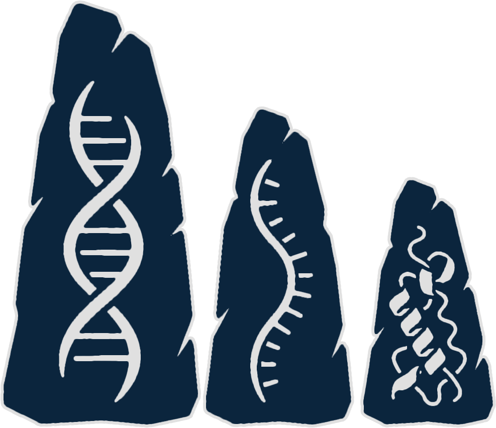
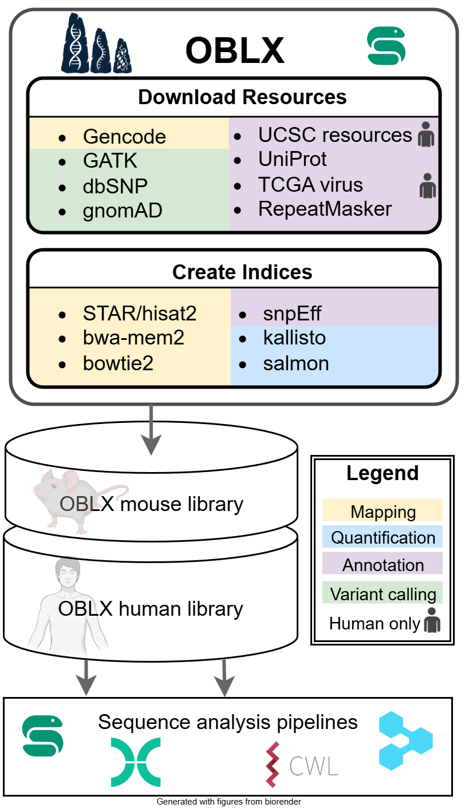

<p align="center">
    
</p>

# OBLX: Omics builder for Bioinformatics resource Libraries and indeXes

<!-- badges: start -->

[](https://snakemake.readthedocs.io)
[](https://github.com/TRON-Private/tronmake-genome-lib-builder/actions/workflows/ci.yaml)

<!-- badges: end -->

**Documentation**: https://tron-bioinformatics.github.io/OBLX

<p align="center">
    
</p>

______________________________________________________________________

**OBLX** (/ˌɒbl.ˈɛks/) is a pipeline which downloads reference genomes, genome
annotations and further resources, and generates from these the indexes required
for various bioinformatics tools and pipelines. The pipeline consists of two
independently executable stages:
[*Download Resources*](https://tron-bioinformatics.github.io/OBLX/pull_resources/)
and
[*Build Indices*](https://tron-bioinformatics.github.io/OBLX/build_indices/).
*Download Resources* retrieves the reference genome, genome annotation and other
resources and prepares the data for bioinformatics index generation. The
reference genome and genome annotation are downloaded from
[GENCODE](https://www.gencodegenes.org/); the preferred genome assembly version,
GENCODE release and organism can be specified via the
[config file](https://tron-bioinformatics.github.io/OBLX/configuration/).
Additional resources from GATK, UCSC and gnomAD are retrieved (see
[*Download Resources*](https://tron-bioinformatics.github.io/OBLX/pull_resources/)
for details). *Build Indices* then generates tool-specific indices. The
resulting genome library is consistent with respect to chromosome, transcript
and gene naming and supports an extensive set of bioinformatics tools, all
listed in
[Supported Tools](https://tron-bioinformatics.github.io/OBLX/supported_tools/).
OBLX is implemented as a Snakemake pipeline (Mölder et al., 2021).

## Pre-built indices

Pre-built OBLX libraries for **human GRCh38 v49** and **mouse GRCm39 vM36** are
available for download via
[ftp://easyfuse.tron-mainz.de/tron_genome_library](ftp://easyfuse.tron-mainz.de/tron_genome_library).

```sh
# human
wget ftp://easyfuse.tron-mainz.de/oblx/v1.0.0/human/GRCh38_49

# mouse
wget ftp://easyfuse.tron-mainz.de/oblx/v1.0.0/mouse/GRCm39_M36
```

## Usage

To run OBLX, adapt and execute the following command:

```
snakemake -s workflow/Snakefile \
	--directory \
	[conda </path/to/output/directory >--software-deployment-method | apptainer] \
	--latency-wait 60 \
	[--configfile \
	[--profile <path/to/config/file >] </path/to/cluster/profile/ >]
```

## Input

OBLX does not require any user-provided input. You only specify the output
directory and, if non-default settings are desired, adapt the
[configuration](https://urban-guacamole-qmm473j.pages.github.io/configuration/).

## Output

The output of the pipeline is written to the directory specified with
`--directory`. Descriptions of the downloaded genome resources are documented in
[*Download Resources*](https://urban-guacamole-qmm473j.pages.github.io/pull_resources/);
descriptions of the generated indices are documented in
[*Build Indices*](https://urban-guacamole-qmm473j.pages.github.io/build_indices/).

## Contribution

We welcome contributions! Please see
[CONTRIBUTING](https://github.com/TRON-Bioinformatics/OBLX/CONTRIBUTING.md) and
[developer_guide](developer_guide.md) for guidelines.

## About

OBLX was originally developed by Luis Kress and Johannes Hausmann at
[TRON - Translational Oncology at the Medical Center of the Johannes Gutenberg University Mainz gGmbH (non-profit)](https://tron-mainz.de/).

Main developers:

- [Luis Kress](mailto:luis.kress@tron-mainz.de)
- [Johannes Hausmann](mailto:johannes.hausmann@tron-mainz.de)
- [Jonas Freimuth](mailto:jonas.freimuth@tron-mainz.de)

## References

- Mölder F, Jablonski KP, Letcher B et al. Sustainable data analysis with
  Snakemake [version 1; peer review: 1 approved, 1 approved with reservations].
  F1000Research 2021, 10:33 (https://doi.org/10.12688/f1000research.29032.1)
- Figure generated with [BioRender](https://app.biorender.com/) icons.
