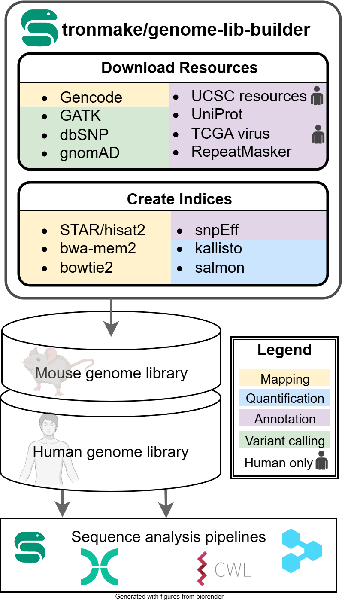

## TronMake Genome Lib Builder

<!-- badges: start -->

[](https://snakemake.readthedocs.io)
[](https://github.com/TRON-Private/tronmake-genome-lib-builder/actions/workflows/ci.yaml)

<!-- badges: end -->

Documentation: https://urban-guacamole-qmm473j.pages.github.io/



The **TronMake Genome Lib Builder** is a Snakemake (Mölder et al., 2021)
pipeline which downloads reference genomes, genome annotations as well as
further resources and generates based on these indexes required for various
bioinformatics tools and pipelines. The pipeline consists of two independently
executable stages: [*Download Resources*](pull_resources.md#download-resources)
and [*Build Indices*](build_indices.md#build-indices). *Download Resources*
retrieves the reference genome, genome annotation and other resources and
prepares the data for bioinformatics index generation. The reference genome and
genome annotation is downloaded from [GENCODE](https://www.gencodegenes.org/)
and the preferred genome assembly version, GENCODE release and organism can be
specified. Furthermore, resources from GATK, UCSC and GnomAD are retrieved (for
details see [*Download Resources*](pull_resources.md#download-resources)
section). *Build Indices* generates bioinformatics tool specific indices. The
generated genome library is consistent with respect to the chromosome,
transcript and gene naming and supports an extensive set of bioinformatics
tools. All supported tools are listed in
[Supported Tools](supported_tools.md#supported-tools).

## Installation

Clone the repository:

```
git clone https://gitlab.rlp.net/tron/tronmake-genome-lib-builder.git
```

Install Snakemake (see
https://snakemake.readthedocs.io/en/stable/getting_started/installation.html).

## Usage

The stages [*Download Resources*](pull_resources.md#download-resources) and
[*Build Indices*](build_indices.md#build-indices) are run consecutively when
executing (to run them independently check the respective section):

```
snakemake -s workflow/Snakefile \
  --directory </path/to/output/directory> \
  --software-deployment-method [conda|apptainer] \
  --latency-wait 60 \ # to account for writing latency of large files
  [--configfile <path/to/config/file>] \
  [--profile </path/to/cluster/profile/>]
```

- `--directory`: Specifies the directory where the results of the workflow
  should be stored.
- `--software-deployment-method`: Can be either `conda` or `apptainer`.
- `--latency-wait`: Wait for e.g. 60 seconds for files to be created due to IO
  latency.
- `--configfile` (optional): Defines e.g. the reference genome version that
  should be used, see [Configuration](configuration.md)
- `--conda-prefix` (optional): Specify a path where conda environments should be
  stored (to reduce redundancy)
- `--profile` (optional): Specify cluster profile to submit jobs e.g. to a HPC

## Input

The TronMake Genome Lib Builder does not require any input. You just have to
specify the output directory and, if non default settings are desired, adapt the
[Configuration](configuration.md#configuration).

## Output

The output of the pipeline is written to the directory specified with
`--directory`. Descriptions of the resulting genome resources can be found in
the [*Download Resources*](pull_resources.md#download-resources) documentation
while description of generated indices is provided in the
[*Build Indices*](build_indices.md#build-indices) documentation.

## Supported bioinformatics tools

See [Supported Tools](supported_tools.md#supported-tools).

## About

The TronMake Genome Lib Builder was originally developed by Luis Kress and
Johannes Hausmann at
[TRON - Translational Oncology at the Medical Center of the Johannes Gutenberg University Mainz gGmbH (non-profit)](https://tron-mainz.de/).

Main developers:

- [Luis Kress](mailto:luis.kress@tron-mainz.de)
- [Johannes Hausmann](mailto:johannes.hausmann@tron-mainz.de)
- [Jonas Freimuth](mailto:jonas.freimuth@tron-mainz.de)

## References

- Mölder F, Jablonski KP, Letcher B et al. Sustainable data analysis with
  Snakemake [version 1; peer review: 1 approved, 1 approved with reservations].
  F1000Research 2021, 10:33 (https://doi.org/10.12688/f1000research.29032.1)
